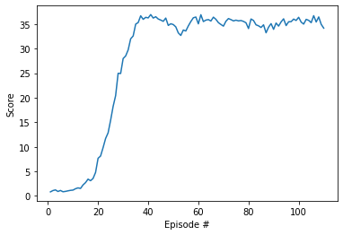

# Solving the Unity Reacher Environment

### 1. Introduction
This project is part of Udacity Deep Reinforcement Nanodegree. 
The objective of this project is to apply Deep Deterministic Policy Gradient ("DDPG") 
([Lillicrap et al., 2016](https://arxiv.org/pdf/1509.02971.pdf)) algorithm to solve the Unity Reacher environment. 

In this environment, a double-jointed arm can move to target locations. 
A reward of +0.1 is provided for each step that the agent's hand is in the goal location. 
Thus, the goal of your agent is to maintain its position at the target location for as many time steps as possible. T
he environment contains 20 identical agents, each with its own copy of the environment. 
The observation space consists of 33 variables corresponding to position, rotation, velocity, and angular velocities of the arm. 
Each action is a vector with four numbers, corresponding to torque applicable to two joints. 
Every entry in the action vector should be a number between -1 and 1. 

To solve the environment, the agents need to get an average score of +30 over 100 consecutive episodes, and over all 20 agents.

### 2. Learning Algorithm
The Reacher environment requires the agent to learn from high dimensional state space and perform actions in continuous action space.
In this project, the Deep Deterministic Policy Gradient ("DDPG") 
([Lillicrap et al., 2016](https://arxiv.org/pdf/1509.02971.pdf)) algorithm was used to solve the environment. 

DDPG learns the optimal action-value function and then define the best action to perform.
Two deep neural networks are used, namely the actor and the critic. 
The actor is used to approximate the optimal policy deterministically, 
whereas the critic learns to evaluate the optimal action value function by using the actor's best-believed action.

The DDPG implementation uses several methodologies for improving performances:
- Replay buffer: use a buffer of previous experiences to learn across a set of uncorrelated events
- Soft-update to target networks: each network have two copies of network weights, the target networks are updated by slowly blending regular network weights with target network weights
- Ornstein-Uhlenbeck process: adds a certain amount of noise correlated to previous noise to the action values at each timestep, allowing exploration of action space with more continuity

### 3. Implementation

#### 3.1 Network Architecture
The DDPG algorithm was implemented using an Actor (Policy) network and a Critic (Value) network.
Both networks share the same architecture, except for the output size.
Both networks have an input layer with size of state dimesion 33, 
followed by two hidden layers of size 512 and 64 respectively.
The output layer of the actor network has size 4 (same as action dimension), 
while the output layer of the critic network has size 1.

Rectifier Linear Units (ReLU) activation functions were used after the first two layers both networks. 
The output layer of the actor network used tanh activation function. The optimization emloyed to train the network was the Adam optimization algorithm.

#### 3.2 Hyperparameters

The hyperparameter chosen were as follows:

|Hyperparameter|Value|
|:-|-:|
|Replay buffer size| 100,000 |
|Minibatch size| 128 |
|Discount factor (gamma)| 0.98 |
|Soft update of target parameters (tau) | 0.001 |
|Learning rate (both actor/critic) | 5e-4|
|L2 weight decay|0|

### 4. Performance Evaluation

The figure below illustrates the learning of an agent using DDPG algorithm, with 20 agents in environment.

At episode 109, the environment was solved with average score over 30.

### 5. Extensions

- Improve the hyperparamers selection (e.g. with grid search)
- Further explore the single agent version: the current agent can be applied to both versions of the environment. While the agent solves the 20-arms environment in 100-200 episodes, the single-arm environment requires more than 2000 episodes, as there is only one agent to learn from rather than having 20 agents in parallel. The next step could be to further explore how to improve the performance of the agent in this environment. 
- Explore other algorithms such as PPO, TNPG, TRPO 
